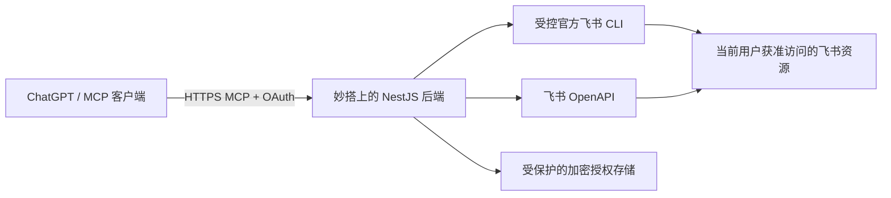

# 飞书 AI 连接器

把本人有权访问的飞书消息、文档、邮件等能力接入 ChatGPT。后端部署在飞书妙搭，通过远程 MCP 提供工具，复用官方飞书 CLI 和 OpenAPI；部署完成后不依赖个人电脑持续在线。

*A self-hosted Feishu connector for ChatGPT, using remote MCP, per-user OAuth, and the official Feishu CLI on Miaoda.*

这是可自行部署的源码，不提供公共共享服务。现有维护者或组织的私有实例不向陌生用户开放；使用者需要准备自己的应用、配置和授权。

## 架构



每位使用者分别完成飞书 OAuth。后端校验当前账号、授权和工具权限，再使用对应用户的凭据执行操作。官方 CLI 通过固定命令映射或受控目录运行，每次使用独立临时目录和环境，不使用任意 shell，也不读取部署者电脑上的 CLI 登录状态。

## 能力

启用原生 CLI 能力后，MCP 提供 **16 个入口：9 个常用工具 + 4 个原生入口 + 3 个兼容入口**。未启用时保留 3 个兼容入口；工具可发现也不代表依赖、权限和资源均已就绪。

| 分组 | 内容 |
| --- | --- |
| 9 个常用工具 | 消息搜索、消息上下文、文档搜索、文档读取、联系人查找、邮件搜索、邮件读取、创建邮件草稿、发送已有草稿 |
| 4 个原生入口 | 按需读取官方 Skill、查询原生方法目录、执行受控原生读取、执行受控原生写入 |
| 3 个兼容入口 | `feishu_catalog`、`feishu_read`、`feishu_write`，保留消息、文档、日历、任务等既有 API 适配 |

固定目录包含 **240 个用户身份业务 JSON 方法**，来自官方 CLI `1.0.95` 的 schema。这个数字表示目录覆盖范围，**不表示全部权限已开通、全部方法已验收或覆盖飞书所有能力**。实际调用还取决于应用资格、用户授权、资源权限和官方接口状态。文件上传下载、任意命令和租户管理员身份不通过原生执行入口开放。

邮件草稿创建与发送分开。发送已有草稿及其他写操作需要当前用户明确意图、对应权限和必要确认；失败或结果不确定时不能盲目重试。

## 部署前提

本项目依赖妙搭的 NestJS 平台 SDK、数据库和 OpenAPI 网关。它是**面向妙搭托管的实现**，不是通用 VPS、Docker 或任意云主机的一键部署包。迁移到其他平台需要替换平台身份、数据库访问和存储网关集成。

部署者需要准备：

- 自己控制的妙搭全栈应用及开发、线上环境。
- 独立飞书开放平台应用、所需用户权限和 OAuth 回调配置。
- 授权存储表、索引、RLS 策略，以及仅限存储路由的服务端 API Key。
- 本实例独立的签名、Cookie 和存储加密密钥。
- 可访问的 HTTPS 地址，以及支持远程 MCP 和相应 OAuth 流程的客户端。

源码、插件模板和示例配置不包含密钥、用户令牌、组织配置或原部署的数据库。每位用户须对自己所使用的实例授权；不能复制其他部署的凭据或授权记录。

## 部署流程

完整说明见 [部署与维护指南](docs/deployment.md)。以下步骤彼此独立，生成配置或插件不会自动完成平台资源配置。

1. 先通过官方妙搭创建流程（`lark-cli apps +create`）建立自己的 `full_stack` 应用，再通过 `lark-cli apps +init` 初始化该应用的工程；按平台开发方式将本仓库业务代码同步进去，保留平台为新应用生成的入口和配置。不要复制其他实例的真实 `.spark` 元数据或 Git 绑定。
2. 在相应环境初始化 [授权存储结构](docs/connector-auth-storage.sql)，配置并验证 RLS。匿名和普通用户不能直接读写凭据表；表结构变更后使用平台流程重新生成数据库类型。
3. 注册存储 OpenAPI 路由，为 `POST /openapi/connector-auth-storage/execute` 配置专用受限 API Key，准备独立密钥。
4. 在飞书应用登记 `${publicUrl}/auth/feishu/callback`，按实际功能申请权限并设置可用范围。代码部署与企业权限审核是不同流程。
5. 以 [配置示例](deployment/instance.example.json) 填写自己的非秘密配置。妙搭环境变量 `CONNECTOR_DEPLOYMENT_CONFIG` 是运行配置的权威来源，本地 `deployment/instance.local.json` 只是被 Git 忽略的调试副本。密钥放在独立服务端环境变量中。
6. 完成构建、发布和隔离检查，按需要启用 `CONNECTOR_NATIVE_CLI_ENABLED=true`。在客户端连接 `${publicUrl}/mcp`，由使用者本人完成 OAuth，再逐项验证实际任务。

维护脚本提供只检查模式：

```sh
node scripts/configure-cloud-auth.mjs --check
```

去掉 `--check` 会写入云配置，并为缺失的服务密钥执行初始化；先阅读部署指南。该脚本不会自动创建应用、数据库表或飞书业务权限，也不能用于原地切换实例身份。

## Skills 与插件包

`plugins/feishu/` 是通用模板，MCP 列表为空，不会连接现有组织的实例。准备好本地配置后运行：

```sh
node scripts/generate-deployment-plugin.mjs
```

生成包位于 `deployment/generated/plugins/feishu/`，包含本实例的连接地址和四个领域 Skills；生成目录不进入 Git。

**添加 MCP 连接不会自动安装仓库中的 Skills。** 生成包需通过支持该格式的宿主及其安装流程加载；生成成功不代表已在 ChatGPT 云端安装。`feishu_skill_read` 按需返回官方 CLI 内置指导内容，也不等于宿主安装了这四个 Skills。

## 开发与检查

使用 Node.js 22 或更新版本，并准备妙搭开发环境及相关依赖的访问权限。

```sh
npm ci
npm run type:check
node scripts/test-deployment-config.mjs
node scripts/test-feishu-task-tools.mjs
node scripts/probe-cli-task-plans.mjs
```

上述三个测试脚本使用合成配置或注入式执行器，不调用真实飞书业务，也不访问云端。远程探针是另一类工具：部分探针会创建临时密钥或合成数据库记录，应按部署指南单独执行。

构建会准备固定版本官方 CLI，并校验发行归档的 SHA-256。升级 CLI 时，需要同时更新目录和输出契约测试；不要仅替换二进制版本号。

## 安全与贡献

安全边界与漏洞报告方式见 [SECURITY.md](SECURITY.md)，开发约定见 [CONTRIBUTING.md](CONTRIBUTING.md)。问题与贡献请前往 [GitHub 仓库](https://github.com/MrPhotato/feishu-ai-connector)。请勿在 Issue、日志、截图或 PR 中提交真实令牌、密钥、内部资料或个人业务记录。

项目自有代码采用 [MIT](LICENSE) 许可证；第三方组件保留各自许可证。官方 CLI 的来源及声明见 [第三方说明](native/THIRD_PARTY_NOTICES.md)。源码许可不授予飞书平台、妙搭服务或他人数据的使用权限。
